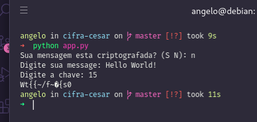

# Cifra de Cézar

Conta a história que Júlio César utilizava um código nas mensagens enviadas a seus generais, um sistema simples de substituição, no qual cada letra da mensagem original era trocada pela letra que se situa três posições à sua frente.

Ficando da seguinte forma: Cada letra “A” era substituída pela Letra “D”, “B” por “E” e assim sucessivamente. Qualquer código que tenha esse padrão é considerado um código de César. O alfabéto possui 26 letras, dessa forma pode-se cifrar o texto de 26 formas diferente

## Resultado

    </img>

